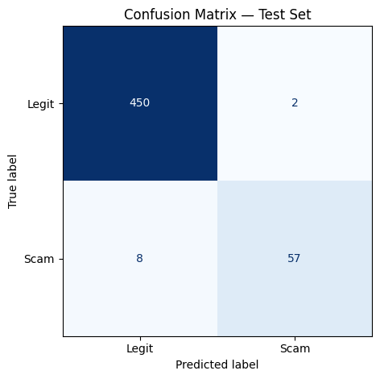
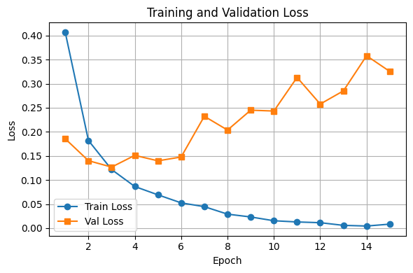
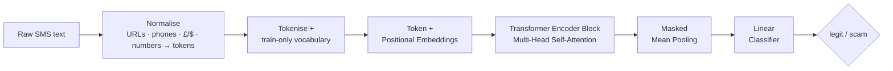
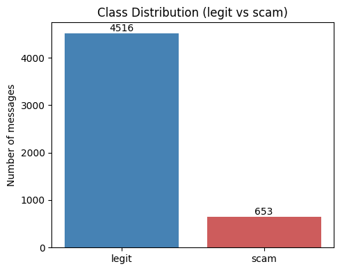
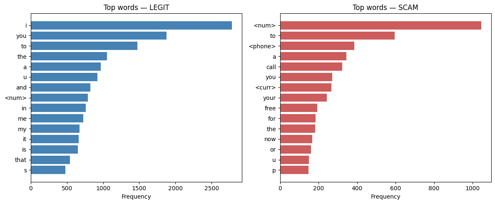
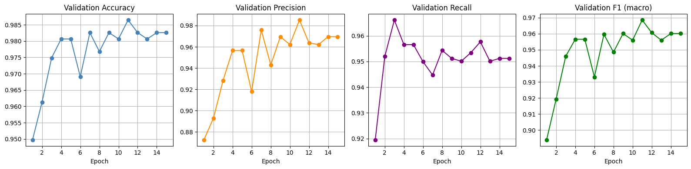
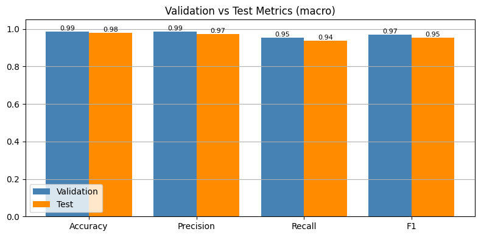
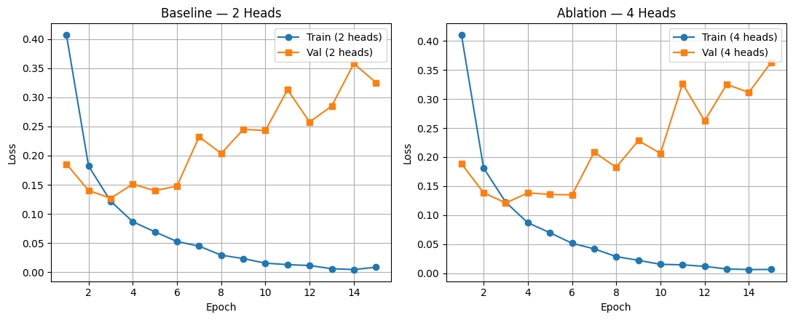

<h1 align="center">📱🛡️ SMS Scam & Spam Detection with a Transformer Encoder</h1>

<p align="center">
  <em>A Transformer encoder built <strong>entirely from scratch</strong> in PyTorch (custom scaled dot-product attention, multi-head attention, and encoder block) that flags scam / spam SMS with <strong>98% accuracy</strong> and a <strong>0.95 macro-F1</strong>.</em>
</p>

<p align="center">by <strong>Aliyah Alabdali</strong></p>

<p align="center">
  
  
  
  
</p>

<p align="center">
  <a href="https://colab.research.google.com/github/AliyahAlabdali/SMS-Scam-Detection-Transformer/blob/main/SMS_Scam_Detection_Transformer.ipynb">
    
  </a>
</p>

---

## ✨ Key Points

- **No `nn.Transformer`, no shortcuts.** Attention, multi-head attention, and the Pre-LN encoder block are implemented from first principles and covered by **unit tests** (shapes, softmax normalisation, masking, gradient flow).
- **Real benchmark, honest evaluation.** Trained on the public **SMS Spam Collection** (5,169 unique messages, ~13% scam) with **stratified splits**, **class-weighted loss**, and **macro-averaged + per-class** metrics, not just accuracy.
- **Strong, generalising results:** **98.07% accuracy**, **0.9542 macro-F1**, only **10 mistakes out of 517** test messages.
- **Complete workflow:** EDA, feature engineering, a dry run, best-checkpoint selection, an **ablation study**, error analysis, and a **live inference demo**.

<p align="center">
  
  
</p>

---

## 📌 Overview

Scam and phishing messages are rare but costly, so a good detector must find the **minority class** without drowning in false alarms. This project treats that as a binary text-classification task and solves it with a **Transformer encoder written from scratch**, so every part of the attention mechanism is transparent and testable rather than hidden behind a library call.

The full journey, from raw text to a working classifier, lives in a single, well-documented notebook:
**[`SMS_Scam_Detection_Transformer.ipynb`](SMS_Scam_Detection_Transformer.ipynb)**.

---

## 🚀 Key Features

| | |
|---|---|
| **From-scratch Transformer** | Scaled dot-product attention → multi-head attention → Pre-LayerNorm encoder block with residual connections and a feed-forward network. |
| **Unit-tested core** | Dedicated tests verify tensor shapes, attention normalisation, padding masks, and gradient flow before any training. |
| **Smart preprocessing** | URLs, e-mails, phone numbers, currency and digits are normalised into special tokens (`<url>`, `<phone>`, `<curr>`, `<num>` …) that capture phishing signals. |
| **Imbalance handled properly** | Stratified 80/10/10 split, inverse-frequency **class weights**, and macro metrics, with no majority-class collapse. |
| **Positional awareness** | Learned positional embeddings + masked mean-pooling over valid tokens. |
| **Best-checkpoint training** | The epoch with the best **validation macro-F1** is restored automatically, sidestepping late-epoch overfitting. |
| **Ablation study** | 2 vs 4 attention heads under identical settings. |
| **Error analysis + demo** | Confusion matrix, inspection of real misclassified texts, and predictions on brand-new messages. |

---

## 🧠 Architecture



**Inside the encoder block** (Pre-LN):
`x → LayerNorm → Multi-Head Attention → + residual → LayerNorm → Feed-Forward → + residual`

**Model configuration:** `d_model = 64` · `num_heads = 2` · `ffn_dim = 128` · `dropout = 0.1` · `max_len = 33`.

---

## 🗂️ Dataset

**SMS Spam Collection**: a public benchmark of real English SMS labelled *ham* (legit) / *spam* (scam).

🔗 **Get the data:** [Kaggle](https://www.kaggle.com/datasets/uciml/sms-spam-collection-dataset) · [UCI ML Repository](https://archive.ics.uci.edu/dataset/228/sms+spam+collection)

| Property | Value |
|---|---|
| Source | [UCI ML Repository](https://archive.ics.uci.edu/dataset/228/sms+spam+collection) (Almeida & Hidalgo, 2011) · [Kaggle mirror](https://www.kaggle.com/datasets/uciml/sms-spam-collection-dataset) |
| Licence | CC BY 4.0 |
| Messages (after de-duplication) | **5,169** |
| Class balance | ~87% legit · ~13% scam (**~7:1 imbalance**) |
| Split | Train **4,135** · Val **517** · Test **517** (stratified) |

> Duplicates are removed **before** splitting to prevent the same text leaking across train/test, a subtle but important guard for honest metrics.

<p align="center">
  
  
</p>

---

## 📈 Results

Evaluated on the held-out **test set** (best checkpoint by validation macro-F1):

| Metric | Score |
|:--|:--:|
| Accuracy | **0.9807** |
| Precision (macro) | **0.9743** |
| Recall (macro) | **0.9362** |
| **F1 (macro)** | **0.9542** |

**Per-class (test):**

| Class | Precision | Recall | F1 | Support |
|:--|:--:|:--:|:--:|:--:|
| legit | 0.983 | 0.996 | 0.989 | 452 |
| scam  | 0.966 | 0.877 | 0.919 | 65 |

<p align="center">
  
</p>
<p align="center">
  
</p>

### 🔎 Error analysis
Out of **517** test messages, the model makes only **10 errors**: **8 missed scams** (false negatives) and **2 false alarms** (false positives). Macro-precision (0.97) exceeds macro-recall (0.94), so the model is **precise but slightly conservative** on the minority class: the few scams it misses are worded like ordinary messages. If catching every scam matters more, scam recall can be raised by increasing the scam class weight or lowering the decision threshold.

---

## 🧪 Ablation Study: Attention Heads (2 vs 4)

Identical settings, only the head count changes:

| Config | Accuracy | Precision | Recall | F1 (macro) |
|:--|:--:|:--:|:--:|:--:|
| Baseline (**2 heads**) | 0.9807 | 0.9743 | 0.9362 | 0.9542 |
| Ablation (**4 heads**) | 0.9807 | 0.9743 | 0.9362 | 0.9542 |

**Finding:** doubling the heads gives **no measurable benefit** on short SMS texts, so the leaner 2-head model is preferable (same accuracy, less compute).

<p align="center">
  
</p>

---

## ⚡ Getting Started

### Option A: Google Colab (recommended, zero setup)
Click the **Open in Colab** badge at the top, then `Runtime → Change runtime type → T4 GPU` and **Run all**. The dataset downloads automatically.

### Option B: Run locally
```bash
git clone https://github.com/AliyahAlabdali/SMS-Scam-Detection-Transformer.git
cd SMS-Scam-Detection-Transformer
pip install -r requirements.txt
jupyter notebook SMS_Scam_Detection_Transformer.ipynb
```

Then run the cells top to bottom. Training on CPU works but a GPU is much faster.

---

## 📁 Project Structure

```
.
├── SMS_Scam_Detection_Transformer.ipynb   # end-to-end notebook (core, EDA, training, evaluation, ablation, demo)
├── assets/                                 # result figures used in this README
│   ├── class_distribution.png
│   ├── top_words.png
│   ├── training_loss.png
│   ├── val_metrics.png
│   ├── val_vs_test.png
│   ├── confusion_matrix.png
│   └── ablation_loss.png
├── requirements.txt
└── README.md
```

---

## 🛠️ Tech Stack
**PyTorch** (custom Transformer) · **scikit-learn** (metrics & splitting) · **pandas** / **NumPy** (data) · **Matplotlib** (visualisation) · **Jupyter**.

## 🧭 Roadmap / Future Work
- Sub-word tokenisation (BPE / WordPiece) to shrink the vocabulary and handle typos
- Stack multiple encoder blocks + a learning-rate scheduler with early stopping
- Attention-weight visualisation for interpretability
- Benchmark against a TF-IDF + Logistic Regression baseline
- Decision-threshold tuning / precision-recall curve for recall-critical deployment

---

## 🙏 Acknowledgements & Citation
Dataset: Almeida, T. A. & Hidalgo, J. M. G. (2011). *SMS Spam Collection.* [UCI Machine Learning Repository](https://archive.ics.uci.edu/dataset/228/sms+spam+collection) (CC BY 4.0).

<p align="center"><sub>Built with PyTorch and a lot of attention by <strong>Aliyah Alabdali</strong>. ⭐ Star the repo if it helped!</sub></p>
